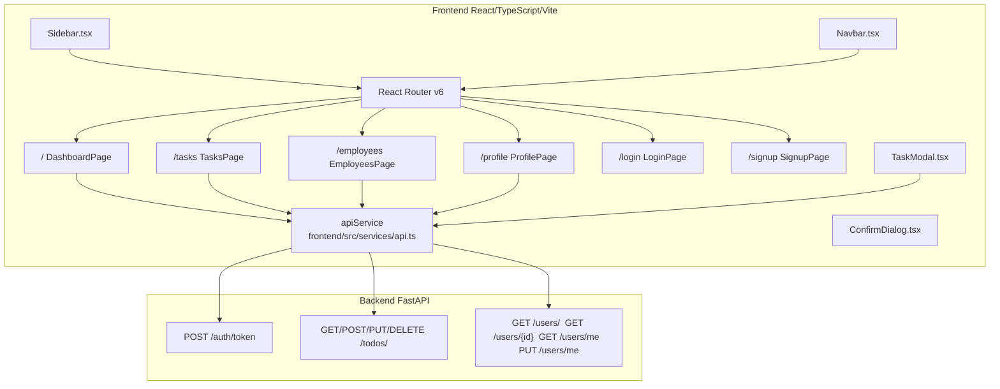
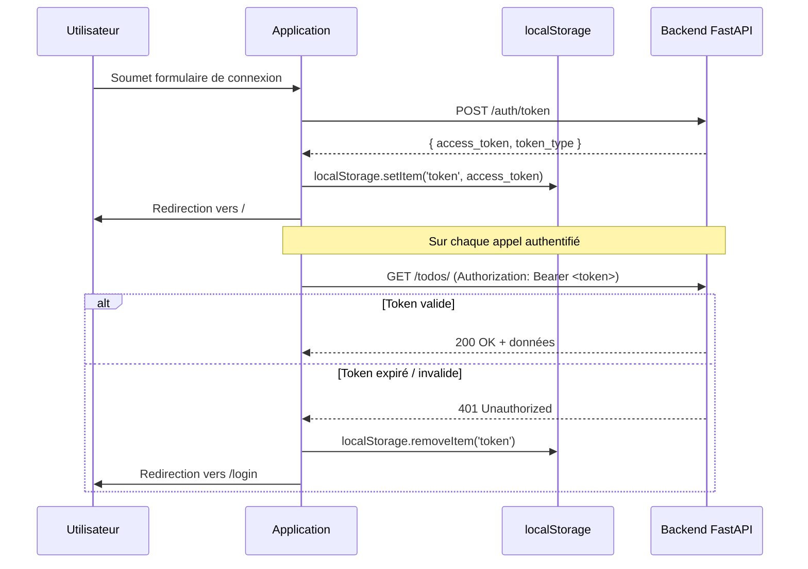
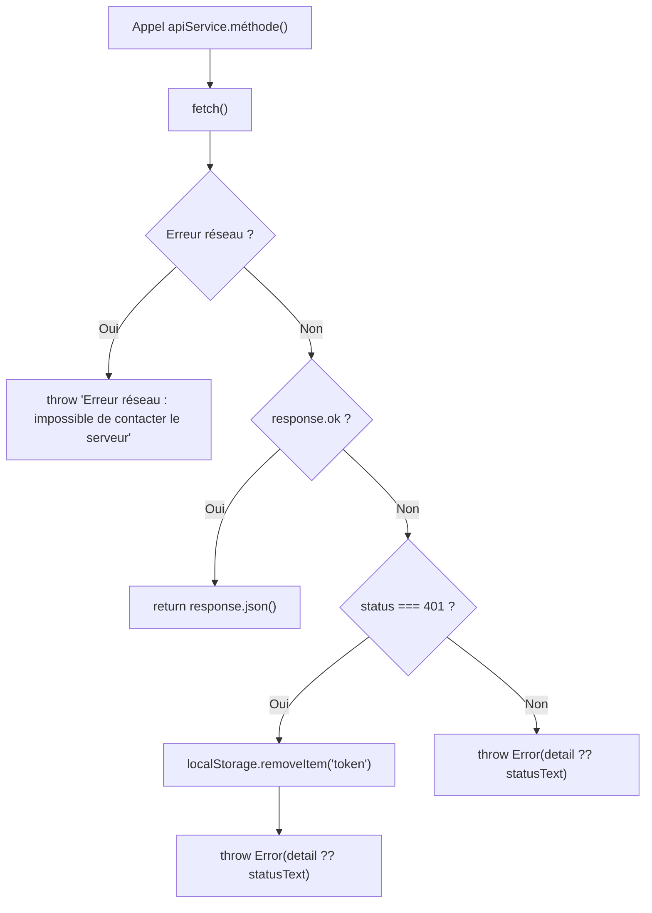

# Document de Design — Plateforme de Gestion d'Équipe

## Vue d'ensemble

La plateforme de gestion d'équipe est une application React/TypeScript construite sur le thème Soft UI Dashboard. Elle s'appuie sur un backend FastAPI existant et permet à des utilisateurs authentifiés de :

- Visualiser un tableau de bord avec les statistiques de leurs tâches
- Gérer leurs tâches (CRUD complet) sur une page dédiée
- Consulter la liste des membres de l'équipe et leurs détails
- Consulter et modifier leur profil

Toutes les interactions réseau passent exclusivement par `apiService` dans `frontend/src/services/api.ts`. Le design conserve les classes CSS du thème Soft UI Dashboard.

---

## Architecture

L'application suit une architecture SPA (Single Page Application) React avec React Router v6 pour la navigation côté client.



### Flux d'authentification



---

## Composants et Interfaces

### Structure des fichiers

```
frontend/src/
├── App.tsx                          # Routes + PrivateRoute (modifié)
├── services/
│   └── api.ts                       # ApiService (modifié : +getUsers, +getUserById)
├── types/
│   └── index.ts                     # Types TypeScript (inchangé)
├── components/
│   ├── Sidebar.tsx                  # Navigation latérale (modifié : +Tasks, +Employees)
│   ├── Navbar.tsx                   # Barre de navigation (inchangé)
│   ├── TaskModal.tsx                # NOUVEAU : Modal formulaire tâche
│   └── ConfirmDialog.tsx            # NOUVEAU : Dialog de confirmation suppression
└── pages/
    ├── DashboardPage.tsx            # Tableau de bord (modifié : vraies stats + modal)
    ├── TasksPage.tsx                # NOUVELLE : CRUD tâches
    ├── EmployeesPage.tsx            # NOUVELLE : Liste + détail employés
    ├── ProfilePage.tsx              # Profil (modifié : formulaire de modification)
    ├── LoginPage.tsx                # Connexion (inchangé)
    └── SignupPage.tsx               # Inscription (inchangé)
```

### App.tsx — Routes

```typescript
// Routes protégées ajoutées
<Route path="/tasks" element={<PrivateRoute><TasksPage /></PrivateRoute>} />
<Route path="/employees" element={<PrivateRoute><EmployeesPage /></PrivateRoute>} />
```

### Sidebar.tsx — Liens de navigation

Quatre liens principaux dans la section principale :
- **Dashboard** (`/`) — icône `ni-tv-2`
- **Tâches** (`/tasks`) — icône `ni-bullet-list-67`
- **Employés** (`/employees`) — icône `ni-single-02`
- **Profil** (`/profile`) — icône `ni-circle-08`

### TaskModal.tsx — Props

```typescript
interface TaskModalProps {
  isOpen: boolean;
  onClose: () => void;
  onSubmit: (data: TaskFormData) => Promise<void>;
  initialData?: Partial<Todo>;   // undefined = création, défini = édition
  title: string;                 // "Nouvelle tâche" | "Modifier la tâche"
}

interface TaskFormData {
  titre: string;
  description: string;
  priority: Priority;
}
```

Le modal utilise les classes Soft UI Dashboard : `modal`, `modal-dialog`, `modal-content`, `card`, `card-header`, `card-body`, `form-control`, `btn bg-gradient-primary`.

### ConfirmDialog.tsx — Props

```typescript
interface ConfirmDialogProps {
  isOpen: boolean;
  onConfirm: () => void;
  onCancel: () => void;
  message: string;
  title?: string;
}
```

### DashboardPage.tsx — Statistiques réelles

Quatre cartes de statistiques calculées depuis `GET /todos/` :
1. **Total des tâches** — nombre total
2. **Priorité haute** — count des tâches `priority === 'high'`
3. **Priorité moyenne** — count des tâches `priority === 'medium'`
4. **Priorité basse** — count des tâches `priority === 'low'`

Bouton "Nouvelle tâche" ouvrant `TaskModal` en mode création.

### TasksPage.tsx — CRUD complet

Tableau avec colonnes : Titre, Description, Priorité (badge coloré), Actions (boutons Modifier / Supprimer).

Badges de priorité :
- `high` → `badge bg-gradient-danger`
- `medium` → `badge bg-gradient-warning`
- `low` → `badge bg-gradient-success`

### EmployeesPage.tsx — Liste + détail

Tableau principal avec colonnes : Nom, Email, Rôle, Statut (badge Actif/Inactif).

Panneau de détail (affiché à droite ou en dessous) au clic sur une ligne :
- Nom, Email, Rôle
- Nombre de tâches associées
- Liste des tâches (titre + priorité)

### ProfilePage.tsx — Formulaire de modification

Ajout d'un formulaire inline (ou modal) avec les champs Nom et Email, pré-remplis depuis `GET /users/me`. Soumission via `PUT /users/me`.

---

## Modèles de données

### Types TypeScript existants (inchangés)

```typescript
// frontend/src/types/index.ts

export type User = {
  id: number;
  name: string;
  email: string;
  role: 'user' | 'admin';
  is_active: boolean;
  tasks?: Todo[];
};

export type Priority = 'low' | 'medium' | 'high';

export type Todo = {
  id: number;
  titre: string;
  description: string;
  priority: Priority;
  owner_id: number;
};

export type AuthResponse = {
  access_token: string;
  token_type: string;
};
```

### Nouveaux types locaux (dans les composants)

```typescript
// Données du formulaire de tâche
interface TaskFormData {
  titre: string;
  description: string;
  priority: Priority;
}

// État local de la page Employés
interface EmployeesPageState {
  employees: User[];
  selectedEmployee: User | null;
  loading: boolean;
  loadingDetail: boolean;
  error: string | null;
}

// État local de la page Tâches
interface TasksPageState {
  todos: Todo[];
  loading: boolean;
  error: string | null;
  modalOpen: boolean;
  editingTodo: Todo | null;
  confirmDeleteId: number | null;
}
```

### Méthodes ApiService ajoutées

```typescript
// Ajouts dans frontend/src/services/api.ts

async getUsers(): Promise<User[]>
// Appelle GET /users/ — retourne la liste complète des utilisateurs

async getUserById(id: number): Promise<User>
// Appelle GET /users/{id} — retourne un utilisateur avec ses tâches
```

---

## Propriétés de Correction

*Une propriété est une caractéristique ou un comportement qui doit rester vrai pour toutes les exécutions valides d'un système — essentiellement, un énoncé formel de ce que le système doit faire. Les propriétés servent de pont entre les spécifications lisibles par l'humain et les garanties de correction vérifiables automatiquement.*

### Propriété 1 : Suppression du token sur réponse 401

*Pour tout* appel HTTP authentifié via `apiService` qui reçoit une réponse `401` du backend, le token JWT doit être supprimé du `localStorage` avant que l'erreur soit propagée à l'appelant.

**Valide : Requirements 3.1, 10.3**

---

### Propriété 2 : Redirection des routes protégées sans token

*Pour toute* route protégée (`/`, `/tasks`, `/employees`, `/profile`), si aucun token valide n'est présent dans le `localStorage`, l'application doit rediriger l'utilisateur vers `/login`.

**Valide : Requirements 3.2, 9.3**

---

### Propriété 3 : Cohérence des compteurs de priorité

*Pour toute* liste de tâches retournée par `GET /todos/`, les compteurs affichés sur le dashboard doivent satisfaire : `count(high) + count(medium) + count(low) == total`, et chaque compteur doit correspondre exactement au nombre de tâches ayant la priorité correspondante dans la liste.

**Valide : Requirements 4.1, 4.2**

---

### Propriété 4 : Rejet des titres vides ou composés de whitespace

*Pour toute* chaîne composée uniquement de caractères whitespace (espaces, tabulations, retours à la ligne), la soumission d'un formulaire de tâche (création ou modification) doit être rejetée et la liste des tâches doit rester inchangée.

**Valide : Requirements 5.3, 6.8**

---

### Propriété 5 : Pré-remplissage fidèle du formulaire d'édition de tâche

*Pour toute* tâche avec des valeurs arbitraires de titre, description et priorité, l'ouverture du modal d'édition doit initialiser les champs du formulaire avec exactement les valeurs actuelles de cette tâche.

**Valide : Requirements 6.4**

---

### Propriété 6 : Propagation des erreurs backend dans l'interface

*Pour toute* opération CRUD sur les tâches (création, modification, suppression) qui reçoit une erreur du backend, le message d'erreur retourné par le backend doit être affiché à l'utilisateur dans l'interface.

**Valide : Requirements 6.9**

---

### Propriété 7 : Routage correct de getUserById

*Pour tout* identifiant entier positif `id`, l'appel à `apiService.getUserById(id)` doit déclencher une requête HTTP vers l'URL `/users/{id}` avec exactement cet identifiant.

**Valide : Requirements 7.6**

---

### Propriété 8 : Pré-remplissage fidèle du formulaire de profil

*Pour tout* profil utilisateur avec des valeurs arbitraires de nom et d'email, l'ouverture du formulaire de modification du profil doit initialiser les champs avec exactement les valeurs actuelles du profil.

**Valide : Requirements 8.2**

---

### Propriété 9 : Rejet des champs profil vides ou whitespace

*Pour toute* combinaison de nom et/ou d'email composés uniquement de whitespace, la soumission du formulaire de modification du profil doit être rejetée et les informations affichées doivent rester inchangées.

**Valide : Requirements 8.5**

---

## Gestion des erreurs

### Stratégie globale

Toutes les erreurs HTTP sont centralisées dans la fonction `request()` de `api.ts`. Les erreurs `401` déclenchent systématiquement la suppression du token et une redirection vers `/login`.



### Gestion par composant

| Composant | Erreur | Comportement |
|-----------|--------|--------------|
| `LoginPage` | 401 | Message "Email ou mot de passe incorrect" |
| `LoginPage` | Autre | Message d'erreur descriptif |
| `DashboardPage` | Chargement tâches | Message d'erreur dans la zone tableau |
| `TasksPage` | CRUD | Message d'erreur dans le modal ou sous le tableau |
| `EmployeesPage` | Chargement liste | Message d'erreur dans la zone tableau |
| `EmployeesPage` | Chargement détail | Message d'erreur dans le panneau détail |
| `ProfilePage` | Chargement profil | Message d'erreur dans la page |
| `ProfilePage` | Mise à jour | Message d'erreur dans le formulaire |
| Tous | 401 | Redirection automatique vers `/login` |

### Validation des formulaires

Tous les formulaires valident côté client avant l'appel API :

- **Titre de tâche** : obligatoire, non vide après `.trim()`
- **Nom de profil** : obligatoire, non vide après `.trim()`
- **Email de profil** : obligatoire, non vide après `.trim()`

Le message d'erreur de validation s'affiche directement sous le champ concerné avec la classe `text-danger text-xs mt-1`.

---

## Stratégie de tests

### Approche duale

La stratégie combine des tests unitaires par exemple et des tests basés sur les propriétés (PBT) pour une couverture complète.

**Tests unitaires** — cas spécifiques, interactions UI, états de chargement et d'erreur.

**Tests de propriétés** — comportements universels vérifiés sur des entrées générées aléatoirement (minimum 100 itérations par propriété).

### Bibliothèque PBT recommandée

[fast-check](https://github.com/dubzzz/fast-check) — bibliothèque PBT TypeScript mature, compatible avec Vitest.

```bash
npm install --save-dev fast-check
```

### Tests unitaires (Vitest + React Testing Library)

| Fichier de test | Scénarios couverts |
|---|---|
| `api.test.ts` | login, signup, getTodos, createTodo, updateTodo, deleteTodo, getProfile, updateProfile, getUsers, getUserById |
| `DashboardPage.test.tsx` | Affichage des stats, ouverture du modal, indicateur de chargement, message d'erreur |
| `TasksPage.test.tsx` | Rendu du tableau, ouverture modal création/édition, confirmation suppression, messages d'erreur |
| `EmployeesPage.test.tsx` | Rendu du tableau, clic sur employé, affichage détail, indicateurs de chargement |
| `ProfilePage.test.tsx` | Affichage profil, ouverture formulaire, soumission, erreurs |
| `TaskModal.test.tsx` | Rendu vide (création), pré-remplissage (édition), validation titre vide |
| `ConfirmDialog.test.tsx` | Affichage, confirmation, annulation |
| `Sidebar.test.tsx` | Présence des 4 liens, lien actif sur route courante |
| `App.test.tsx` | Routes protégées sans token → redirection /login |

### Tests de propriétés (fast-check)

Chaque test de propriété doit être annoté avec le tag :
`// Feature: plateforme-gestion-equipe, Property N: <texte de la propriété>`

**Propriété 1 — Suppression du token sur 401**
```typescript
// Feature: plateforme-gestion-equipe, Property 1: token supprimé sur 401
fc.assert(fc.asyncProperty(
  fc.constantFrom('getTodos', 'getProfile', 'getUsers'),
  async (method) => {
    localStorage.setItem('token', 'fake-token');
    mockFetch401();
    await expect(apiService[method]()).rejects.toThrow();
    expect(localStorage.getItem('token')).toBeNull();
  }
), { numRuns: 100 });
```

**Propriété 2 — Routes protégées sans token**
```typescript
// Feature: plateforme-gestion-equipe, Property 2: redirection /login sans token
fc.assert(fc.property(
  fc.constantFrom('/', '/tasks', '/employees', '/profile'),
  (route) => {
    localStorage.removeItem('token');
    render(<App />, { route });
    expect(window.location.pathname).toBe('/login');
  }
), { numRuns: 100 });
```

**Propriété 3 — Cohérence des compteurs de priorité**
```typescript
// Feature: plateforme-gestion-equipe, Property 3: cohérence compteurs priorité
fc.assert(fc.property(
  fc.array(fc.record({
    id: fc.integer({ min: 1 }),
    titre: fc.string({ minLength: 1 }),
    description: fc.string(),
    priority: fc.constantFrom('low', 'medium', 'high'),
    owner_id: fc.integer({ min: 1 }),
  })),
  (todos) => {
    const stats = computeStats(todos);
    return stats.high + stats.medium + stats.low === todos.length
      && stats.high === todos.filter(t => t.priority === 'high').length
      && stats.medium === todos.filter(t => t.priority === 'medium').length
      && stats.low === todos.filter(t => t.priority === 'low').length;
  }
), { numRuns: 100 });
```

**Propriété 4 — Rejet des titres whitespace**
```typescript
// Feature: plateforme-gestion-equipe, Property 4: rejet titres whitespace
fc.assert(fc.property(
  fc.stringOf(fc.constantFrom(' ', '\t', '\n', '\r')),
  (whitespaceTitle) => {
    const result = validateTaskTitle(whitespaceTitle);
    return result.isValid === false;
  }
), { numRuns: 100 });
```

**Propriété 5 — Pré-remplissage fidèle du modal d'édition**
```typescript
// Feature: plateforme-gestion-equipe, Property 5: pré-remplissage modal édition
fc.assert(fc.asyncProperty(
  fc.record({
    id: fc.integer({ min: 1 }),
    titre: fc.string({ minLength: 1 }),
    description: fc.string(),
    priority: fc.constantFrom('low', 'medium', 'high'),
    owner_id: fc.integer({ min: 1 }),
  }),
  async (todo) => {
    const { getByLabelText } = render(<TaskModal isOpen initialData={todo} ... />);
    expect(getByLabelText('Titre').value).toBe(todo.titre);
    expect(getByLabelText('Description').value).toBe(todo.description);
    expect(getByLabelText('Priorité').value).toBe(todo.priority);
  }
), { numRuns: 100 });
```

**Propriété 6 — Propagation des erreurs backend**
```typescript
// Feature: plateforme-gestion-equipe, Property 6: propagation erreurs backend
fc.assert(fc.asyncProperty(
  fc.string({ minLength: 1 }),
  fc.constantFrom('create', 'update', 'delete'),
  async (errorMessage, operation) => {
    mockApiError(operation, errorMessage);
    const { getByText } = render(<TasksPage />);
    await triggerOperation(operation);
    expect(getByText(errorMessage)).toBeInTheDocument();
  }
), { numRuns: 100 });
```

**Propriété 7 — Routage correct de getUserById**
```typescript
// Feature: plateforme-gestion-equipe, Property 7: routage getUserById
fc.assert(fc.asyncProperty(
  fc.integer({ min: 1, max: 10000 }),
  async (id) => {
    const fetchSpy = mockFetch();
    await apiService.getUserById(id).catch(() => {});
    expect(fetchSpy).toHaveBeenCalledWith(
      expect.stringContaining(`/users/${id}`),
      expect.any(Object)
    );
  }
), { numRuns: 100 });
```

**Propriété 8 — Pré-remplissage fidèle du formulaire de profil**
```typescript
// Feature: plateforme-gestion-equipe, Property 8: pré-remplissage formulaire profil
fc.assert(fc.asyncProperty(
  fc.record({
    id: fc.integer({ min: 1 }),
    name: fc.string({ minLength: 1 }),
    email: fc.emailAddress(),
    role: fc.constantFrom('user', 'admin'),
    is_active: fc.boolean(),
  }),
  async (user) => {
    mockGetProfile(user);
    const { getByLabelText, getByText } = render(<ProfilePage />);
    await userEvent.click(getByText('Modifier le profil'));
    expect(getByLabelText('Nom').value).toBe(user.name);
    expect(getByLabelText('Email').value).toBe(user.email);
  }
), { numRuns: 100 });
```

**Propriété 9 — Rejet des champs profil whitespace**
```typescript
// Feature: plateforme-gestion-equipe, Property 9: rejet champs profil whitespace
fc.assert(fc.property(
  fc.record({
    name: fc.oneof(
      fc.stringOf(fc.constantFrom(' ', '\t', '\n')),
      fc.string({ minLength: 1 })
    ),
    email: fc.oneof(
      fc.stringOf(fc.constantFrom(' ', '\t', '\n')),
      fc.emailAddress()
    ),
  }).filter(({ name, email }) => !name.trim() || !email.trim()),
  ({ name, email }) => {
    const result = validateProfileForm({ name, email });
    return result.isValid === false;
  }
), { numRuns: 100 });
```

### Configuration Vitest

```typescript
// vitest.config.ts
export default {
  test: {
    environment: 'jsdom',
    setupFiles: ['./src/test/setup.ts'],
    globals: true,
  }
}
```

Chaque test de propriété doit être configuré avec `{ numRuns: 100 }` au minimum.
