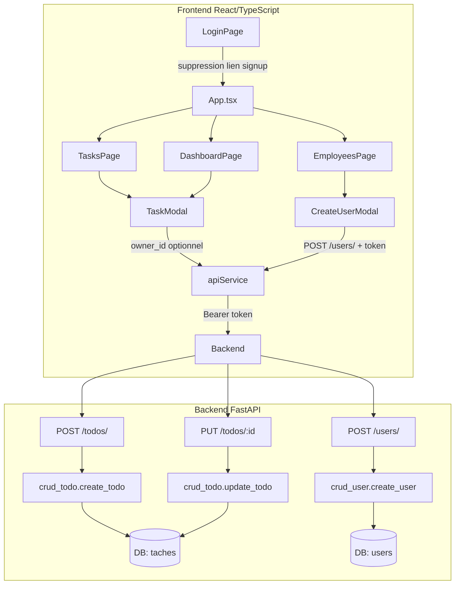

# Document de Design — `task-status-and-admin`

## Vue d'ensemble

Cette fonctionnalité enrichit la plateforme de gestion d'équipe sur trois axes :

1. **Cycle de vie des tâches** : ajout d'un champ `status` (`en_cours`, `a_tester`, `approuve`) sur le modèle `Tache`, visible et modifiable depuis l'interface.
2. **Assignation admin** : lors de la création d'une tâche, un administrateur peut choisir le propriétaire via un champ `owner_id` optionnel dans `TodoCreate`.
3. **Restriction de l'inscription** : `POST /users/` devient un endpoint protégé réservé aux admins ; la page `/signup` publique est supprimée du frontend.

Les changements touchent la base de données (migration `ALTER TABLE`), le backend FastAPI (modèles, schémas, CRUD, endpoints) et le frontend React/TypeScript (types, service API, composants, pages).

---

## Architecture



### Flux de détection du rôle admin (frontend)

Au chargement des pages `TasksPage`, `DashboardPage` et `EmployeesPage`, un appel `GET /users/me` est effectué via `apiService.getProfile()`. Le champ `role` de la réponse détermine si les contrôles admin (sélecteur d'assignation, bouton "Créer un compte") sont affichés.

---

## Composants et interfaces

### Backend

#### `app/models/todo.py` — ajout de `StatusEnum` et colonne `status`

```python
class StatusEnum(str, PyEnum):
    EN_COURS  = "en_cours"
    A_TESTER  = "a_tester"
    APPROUVE  = "approuve"

class Tache(Base):
    # ... colonnes existantes ...
    status = Column(
        Enum(StatusEnum, name="status_enum"),
        default=StatusEnum.EN_COURS,
        nullable=False,
    )
```

#### `app/schemas/todo.py` — mise à jour des schémas

```python
from app.models.todo import PriorityEnum, StatusEnum

class TodoBase(BaseModel):
    titre: str
    description: Optional[str] = None
    priority: PriorityEnum = PriorityEnum.MEDIUM
    status: StatusEnum = StatusEnum.EN_COURS   # nouveau

class TodoCreate(TodoBase):
    owner_id: Optional[int] = None             # nouveau — admin uniquement

class TodoResponse(TodoBase):
    id: int
    owner_id: int
    class Config:
        from_attributes = True
```

#### `app/crud/crud_todo.py` — mise à jour de `create_todo` et `update_todo`

- `create_todo(db, todo, user_id)` : si `todo.owner_id` est fourni, utiliser cette valeur comme `owner_id` ; sinon utiliser `user_id`.
- `update_todo(db, db_todo, todo_in)` : persister `todo_in.status` en plus des champs existants.

#### `app/api/endpoints/todos.py` — logique d'assignation dans `create_todo`

```
POST /todos/
  1. Récupérer current_user
  2. Si todo.owner_id fourni ET current_user.role != ADMIN → HTTP 403
  3. Si todo.owner_id fourni ET utilisateur cible inexistant → HTTP 404
  4. effective_owner_id = todo.owner_id ?? current_user.id
  5. crud_todo.create_todo(db, todo, user_id=effective_owner_id)
```

#### `app/api/endpoints/users.py` — protection de `POST /users/`

```
POST /users/
  1. Dépendance get_current_user (→ HTTP 401 si absent)
  2. Si current_user.role != ADMIN → HTTP 403 "Droits administrateur requis"
  3. Vérifier unicité email → HTTP 400 si doublon
  4. crud_user.create_user(db, user)
```

Le schéma `UserCreate` est étendu avec un champ `role: Optional[RoleEnum] = RoleEnum.USER`.

### Frontend

#### `frontend/src/types/index.ts`

```typescript
export type Status = 'en_cours' | 'a_tester' | 'approuve';

export type Todo = {
  id: number;
  titre: string;
  description: string;
  priority: Priority;
  status: Status;      // nouveau
  owner_id: number;
};
```

#### `frontend/src/components/TaskModal.tsx`

Nouvelles props :

```typescript
interface TaskModalProps {
  isOpen: boolean;
  onClose: () => void;
  onSubmit: (data: TaskFormData) => Promise<void>;
  initialData?: Partial<Todo>;
  title: string;
  users?: User[];          // liste des utilisateurs (admin uniquement)
  currentUserId?: number;  // id de l'utilisateur connecté
  isAdmin?: boolean;       // affiche le sélecteur d'assignation
}
```

`TaskFormData` étendu :

```typescript
export interface TaskFormData {
  titre: string;
  description: string;
  priority: Priority;
  status: Status;          // nouveau
  owner_id?: number;       // nouveau — transmis uniquement si admin
}
```

Comportement :
- Sélecteur de statut toujours visible (3 options).
- Sélecteur "Assigner à" visible uniquement si `isAdmin === true`.
- En mode création admin, pré-sélectionner `currentUserId`.
- En mode édition, pré-sélectionner `initialData.status` et `initialData.owner_id`.

#### `frontend/src/services/api.ts`

| Méthode | Changement |
|---|---|
| `createTodo` | Transmet `status` et `owner_id` (si fourni) dans le corps JSON |
| `updateTodo` | Transmet `status` dans le corps JSON |
| `createUser` | Nouvelle méthode — `POST /users/` avec token Bearer, transmet `name`, `email`, `password`, `role` |
| `signup` | Supprimée (ou conservée en interne mais non exposée publiquement) |

#### `frontend/src/pages/TasksPage.tsx`

- Appel `getProfile()` au montage pour détecter le rôle admin.
- Si admin : appel `getUsers()` pour alimenter le sélecteur d'assignation.
- Passage des props `isAdmin`, `users`, `currentUserId` au `TaskModal`.
- Ajout de la colonne "Statut" dans le tableau avec `statusBadge()`.

#### `frontend/src/pages/DashboardPage.tsx`

- Appel `getProfile()` au montage.
- Remplacement de la carte "Priorité basse" par une carte "Approuvé" (`bg-gradient-success`).
- Calcul : `stats.approuve = todos.filter(t => t.status === 'approuve').length`.
- Passage des props admin au `TaskModal` si l'utilisateur est admin.

#### `frontend/src/pages/EmployeesPage.tsx`

- Appel `getProfile()` au montage pour détecter le rôle admin.
- Si admin : affichage d'un bouton "Créer un compte" dans le header de la carte.
- Formulaire inline (ou modal) avec champs : nom, email, mot de passe, rôle.
- Appel `apiService.createUser()` à la soumission, puis rechargement de la liste.

#### `frontend/src/App.tsx`

- Suppression de la route `/signup` et de l'import `SignupPage`.
- La route catch-all `*` redirige déjà vers `/`.

#### `frontend/src/pages/LoginPage.tsx`

- Suppression du lien "Sign up" pointant vers `/signup`.

---

## Modèles de données

### Migration base de données

La colonne `status` est ajoutée via une migration SQL :

```sql
-- Création du type enum PostgreSQL
CREATE TYPE status_enum AS ENUM ('en_cours', 'a_tester', 'approuve');

-- Ajout de la colonne avec valeur par défaut
ALTER TABLE taches
  ADD COLUMN status status_enum NOT NULL DEFAULT 'en_cours';
```

> **Décision** : utiliser `ALTER TABLE` plutôt que de recréer la table pour préserver les données existantes. Toutes les tâches existantes recevront automatiquement la valeur `en_cours`.

### Schéma de la table `taches` après migration

| Colonne | Type | Contraintes |
|---|---|---|
| `id` | INTEGER | PK, auto-increment |
| `titre` | VARCHAR | NOT NULL |
| `description` | VARCHAR | nullable |
| `owner_id` | INTEGER | FK → users.id, CASCADE |
| `priority` | priority_enum | NOT NULL, default MEDIUM |
| `status` | status_enum | NOT NULL, default en_cours |

### Schéma de la table `users` (inchangé, rappel)

| Colonne | Type | Contraintes |
|---|---|---|
| `id` | INTEGER | PK |
| `name` | VARCHAR(100) | NOT NULL |
| `email` | VARCHAR(150) | UNIQUE, NOT NULL |
| `hashed_password` | VARCHAR(255) | NOT NULL |
| `is_active` | BOOLEAN | default TRUE |
| `role` | role_enum | NOT NULL, default user |

### Extension de `UserCreate`

```python
class UserCreate(UserBase):
    password: str
    role: Optional[RoleEnum] = RoleEnum.USER  # nouveau
```

---

## Propriétés de correction

*Une propriété est une caractéristique ou un comportement qui doit rester vrai pour toutes les exécutions valides d'un système — c'est essentiellement un énoncé formel de ce que le système doit faire. Les propriétés servent de pont entre les spécifications lisibles par l'humain et les garanties de correction vérifiables automatiquement.*

### Propriété 1 : Round-trip du statut d'une tâche

*Pour toute* combinaison valide de (titre, description, priorité, status), créer une tâche via l'API puis la récupérer doit retourner exactement le même status que celui fourni à la création. Si aucun status n'est fourni, le status retourné doit être `en_cours`.

**Valide : Requirements 1.3, 1.5**

---

### Propriété 2 : Mise à jour du statut persistée

*Pour toute* tâche existante et toute valeur de status valide (`en_cours`, `a_tester`, `approuve`), envoyer `PUT /todos/{id}` avec ce status doit résulter en un status identique lors de la lecture suivante de la tâche.

**Valide : Requirements 2.1**

---

### Propriété 3 : Isolation des tâches entre utilisateurs

*Pour tout* utilisateur A tentant de modifier une tâche appartenant à un utilisateur B (B ≠ A), l'API doit retourner HTTP 404, quelle que soit la valeur du status ou des autres champs fournis.

**Valide : Requirements 2.3**

---

### Propriété 4 : Résolution du propriétaire lors de la création d'une tâche (admin)

*Pour tout* administrateur créant une tâche, le `owner_id` effectivement persisté doit être :
- le `owner_id` fourni dans la requête, s'il correspond à un utilisateur existant ;
- l'identifiant de l'administrateur lui-même, si aucun `owner_id` n'est fourni.

**Valide : Requirements 3.2, 3.3**

---

### Propriété 5 : Rejet de l'assignation par un non-admin

*Pour tout* utilisateur avec `role=user` fournissant un `owner_id` différent de son propre identifiant dans `POST /todos/`, l'API doit retourner HTTP 403, quelle que soit la valeur de `owner_id`.

**Valide : Requirements 3.4**

---

### Propriété 6 : Création d'utilisateur avec rôle — round-trip

*Pour toute* combinaison valide de (name, email, password, role), un administrateur créant un utilisateur via `POST /users/` doit recevoir un `UserResponse` dont le champ `role` correspond exactement au rôle fourni (ou `user` si aucun rôle n'est spécifié).

**Valide : Requirements 4.3, 4.5**

---

### Propriété 7 : Protection de POST /users/ contre les non-admins

*Pour tout* utilisateur avec `role=user` authentifié envoyant `POST /users/`, l'API doit retourner HTTP 403 avec le message `"Droits administrateur requis"`, quelles que soient les données fournies.

**Valide : Requirements 4.2**

---

### Propriété 8 : Badge de statut cohérent avec la valeur

*Pour toute* tâche avec un status valide rendue dans `TasksPage`, le badge affiché doit correspondre exactement au mapping suivant :
- `en_cours` → classe CSS bleue (`bg-gradient-info`) + libellé `"En cours"`
- `a_tester` → classe CSS orange (`bg-gradient-warning`) + libellé `"À tester"`
- `approuve` → classe CSS verte (`bg-gradient-success`) + libellé `"Approuvé"`

**Valide : Requirements 5.3, 5.4, 5.5**

---

### Propriété 9 : Round-trip du statut dans le formulaire TaskModal

*Pour tout* status valide fourni en `initialData` au `TaskModal`, le sélecteur doit pré-sélectionner ce status, et la soumission du formulaire sans modification doit transmettre ce même status à `onSubmit`.

**Valide : Requirements 6.3, 6.4**

---

### Propriété 10 : Compteur "Approuvé" du Dashboard

*Pour toute* liste de tâches avec des statuts variés, le compteur affiché dans la carte "Approuvé" du `DashboardPage` doit être égal au nombre exact de tâches dont `status === 'approuve'`.

**Valide : Requirements 7.1**

---

### Propriété 11 : Visibilité conditionnelle du sélecteur d'assignation

*Pour tout* état de `TaskModal`, le sélecteur "Assigner à" doit être visible si et seulement si `isAdmin === true`. Pour toute liste d'utilisateurs fournie avec `isAdmin=true`, le sélecteur doit contenir exactement ces utilisateurs.

**Valide : Requirements 9.1, 9.4**

---

### Propriété 12 : Pré-sélection et transmission du owner_id (admin)

*Pour tout* `currentUserId` admin en mode création, le sélecteur "Assigner à" doit pré-sélectionner `currentUserId`. Pour tout `owner_id` sélectionné dans le sélecteur, la soumission du formulaire doit transmettre ce `owner_id` à `onSubmit`.

**Valide : Requirements 9.2, 9.3**

---

### Propriété 13 : Visibilité du bouton "Créer un compte" selon le rôle

*Pour tout* utilisateur avec `role=admin` sur `EmployeesPage`, le bouton "Créer un compte" doit être visible. *Pour tout* utilisateur avec `role=user`, ce bouton doit être absent du DOM.

**Valide : Requirements 8.1**

---

### Propriété 14 : Soumission du formulaire de création de compte

*Pour toute* combinaison valide de (name, email, password, role) soumise par un admin depuis `EmployeesPage`, la fonction `apiService.createUser` doit être appelée avec exactement ces données, et la liste des employés doit être rechargée après succès.

**Valide : Requirements 8.3**

---

## Gestion des erreurs

### Backend

| Situation | Code HTTP | Message |
|---|---|---|
| Token absent ou invalide sur endpoint protégé | 401 | (géré par FastAPI/dépendance) |
| Utilisateur non-admin sur `POST /users/` | 403 | `"Droits administrateur requis"` |
| Utilisateur non-admin fournissant `owner_id` ≠ son id | 403 | `"Droits administrateur requis pour assigner une tâche"` |
| `owner_id` fourni mais utilisateur inexistant | 404 | `"Utilisateur cible non trouvé"` |
| Tâche non trouvée ou non autorisée | 404 | `"Tâche non trouvée ou non autorisée"` |
| Email déjà enregistré | 400 | `"Email déjà enregistré"` |
| Valeur de `status` invalide | 422 | (géré automatiquement par Pydantic) |

### Frontend

| Situation | Comportement |
|---|---|
| Erreur 401 sur appel API | Suppression du token + redirection vers `/login` |
| Erreur 403 sur création de tâche | Affichage du message d'erreur dans `TaskModal` |
| Erreur 404 sur mise à jour | Affichage du message dans la page |
| Erreur 400 sur création de compte | Affichage du message dans le formulaire, formulaire non fermé |
| Erreur réseau | Message générique `"Erreur réseau : impossible de contacter le serveur"` |

---

## Stratégie de test

### Approche duale

Les tests sont organisés en deux niveaux complémentaires :

1. **Tests unitaires / exemples** : vérifient des comportements spécifiques, des cas limites et des états d'erreur.
2. **Tests basés sur les propriétés (PBT)** : vérifient les propriétés universelles sur un large espace d'entrées générées aléatoirement.

### Backend (Python)

**Bibliothèque PBT** : [Hypothesis](https://hypothesis.readthedocs.io/) — bibliothèque de référence pour le PBT en Python.

**Configuration** : chaque test de propriété doit s'exécuter avec un minimum de 100 itérations (`settings(max_examples=100)`).

**Tag de référence** : chaque test de propriété doit inclure un commentaire :
```python
# Feature: task-status-and-admin, Propriété N: <texte de la propriété>
```

**Tests de propriétés backend** :

| Propriété | Stratégie Hypothesis |
|---|---|
| P1 — Round-trip status | `@given(st.sampled_from(StatusEnum), st.text(min_size=1), st.text(), st.sampled_from(PriorityEnum))` |
| P2 — Mise à jour status persistée | `@given(st.sampled_from(StatusEnum), st.sampled_from(StatusEnum))` |
| P3 — Isolation tâches | `@given(st.integers(min_value=1), st.integers(min_value=1))` avec deux users distincts |
| P4 — Résolution owner_id | `@given(st.booleans())` (avec ou sans owner_id) |
| P5 — Rejet assignation non-admin | `@given(st.integers(min_value=1))` pour owner_id différent |
| P6 — Création user round-trip | `@given(st.sampled_from(RoleEnum), st.text(min_size=1), st.emails())` |
| P7 — Protection POST /users/ | `@given(st.builds(UserCreate, ...))` avec user non-admin |

**Tests unitaires backend** :
- Vérification des valeurs de `StatusEnum` (3 valeurs exactes)
- Vérification du schéma `TodoCreate` (champ `status` par défaut, `owner_id` optionnel)
- HTTP 401 sur `POST /users/` sans token
- HTTP 400 sur email dupliqué
- HTTP 404 sur `owner_id` inexistant
- HTTP 422 sur status invalide

### Frontend (TypeScript/React)

**Bibliothèque PBT** : [fast-check](https://fast-check.dev/) — bibliothèque de référence pour le PBT en TypeScript.

**Framework de test** : Vitest + React Testing Library.

**Configuration** : chaque test de propriété doit s'exécuter avec un minimum de 100 itérations (`numRuns: 100`).

**Tag de référence** :
```typescript
// Feature: task-status-and-admin, Propriété N: <texte de la propriété>
```

**Tests de propriétés frontend** :

| Propriété | Stratégie fast-check |
|---|---|
| P8 — Badge statut cohérent | `fc.constantFrom('en_cours', 'a_tester', 'approuve')` + données Todo aléatoires |
| P9 — Round-trip statut formulaire | `fc.constantFrom('en_cours', 'a_tester', 'approuve')` |
| P10 — Compteur Approuvé | `fc.array(fc.record({ status: fc.constantFrom(...) }))` |
| P11 — Visibilité sélecteur assignation | `fc.boolean()` pour isAdmin + `fc.array(fc.record({ id: fc.integer(), name: fc.string() }))` |
| P12 — Pré-sélection owner_id | `fc.integer({ min: 1 })` pour currentUserId |
| P13 — Bouton Créer un compte | `fc.constantFrom('admin', 'user')` pour le rôle |
| P14 — Soumission formulaire création | `fc.record({ name: fc.string(), email: fc.emailAddress(), role: fc.constantFrom('user', 'admin') })` |

**Tests unitaires frontend** :
- Rendu de la colonne "Statut" dans `TasksPage`
- Sélecteur de statut avec 3 options dans `TaskModal`
- Pré-sélection `en_cours` en mode création
- Affichage `"—"` pendant le chargement sur `DashboardPage`
- Affichage du formulaire après clic "Créer un compte"
- Fermeture du formulaire après succès de création
- Affichage du message d'erreur sans fermeture en cas d'échec
- Absence du lien `/signup` dans `LoginPage`
- Redirection de `/signup` vers `/`

### Tests d'intégration

- `POST /todos/` avec `owner_id` valide (admin) → vérifier persistance
- `POST /todos/` sans `owner_id` (admin) → vérifier `owner_id == admin.id`
- `PUT /todos/{id}` avec nouveau status → vérifier persistance
- `POST /users/` (admin) → vérifier création et réponse
- Flux complet : login admin → créer compte → login nouveau compte → créer tâche assignée
